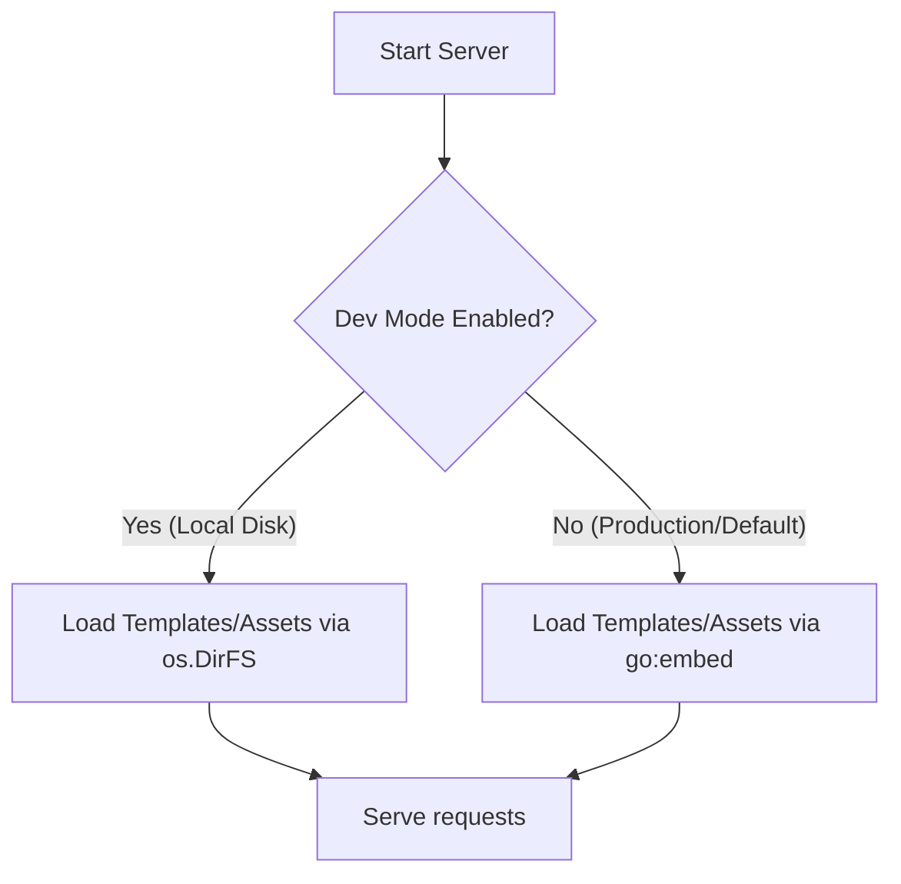

# Technical Plan: Default Embedded Templates and Assets

This document outlines the strategy to transition MDBlog to use embedded templates and assets by default. This makes the application fully self-contained in production, optimizes serving latency, and simplifies the repository's build layout by removing the separate embed-specific commands.

---

## 1. Goal

1. **Self-Contained Executables**: Make all compiled binaries (`mdblog` CLI and `lambda` handler) contain `templates/` and `assets/` embedded by default.
2. **Simplified Build Pipeline**: Consolidate `cmd/lambda` and `cmd/lambda-embed` into a single production handler, and drop duplicate Dockerfiles.
3. **Preserve Developer Workflow**: Allow local development (`mdblog serve`) to dynamically reload templates and stylesheets from the local filesystem on modification without requiring a recompilation.

---

## 2. Architectural Design



### Dev Mode Hook
To keep development fast, we will check a configuration flag (`dev_mode` in `config.toml`) or an environment variable (`MDBLOG_DEV=true`).
* **In Production**: Files are loaded directly from memory via `embed.FS`.
* **In Development**: Files are read from the filesystem dynamically on every request to allow instant feedback when modifying HTML or CSS files.

---

## 3. Implementation Steps

### Phase 1: Update Server Filesystem Defaults
1. Modify `internal/server/handler.go` to import the root package `github.com/ramayac/mdblog`.
2. Change the default values of `TemplateFS` and `AssetsFS` to fallback to the embedded filesystem:
   ```go
   import mdblog "github.com/ramayac/mdblog"

   var TemplateFS fs.FS = mdblog.EmbeddedTemplates()
   var AssetsFS fs.FS = mdblog.EmbeddedAssets()
   ```
3. Inside `server.New()`, check the `DevMode` configuration or environment variable. If enabled, re-assign `TemplateFS` and `AssetsFS` to load from disk:
   ```go
   if cfg.DevMode || os.Getenv("MDBLOG_DEV") == "true" {
       TemplateFS = os.DirFS(cfg.TemplatesDir) // e.g. "templates"
       AssetsFS = os.DirFS(cfg.AssetsDir)       // e.g. "assets"
   }
   ```

### Phase 2: Consolidate Binaries and Dockerfiles
1. **Remove `cmd/lambda-embed`**: Delete the directory `cmd/lambda-embed` completely, as its functionality will now be the standard behavior of `cmd/lambda`.
2. **Remove `Dockerfile.embed`**: Delete the embed Dockerfile since `Dockerfile` will now build the embedded binary by default.
3. **Simplify `Dockerfile`**:
   - Remove copy commands that copy `templates/` and `assets/` into the final production runner stage.
   - The production container will only require the compiled `lambda` binary, `content/`, and `config.toml`.

### Phase 3: Build Pipeline and Makefile Cleanup
1. **Update config schema**: Add `dev_mode = false` configuration default in `internal/config/config.go`.
2. **Update Makefile**:
   - Remove the `build-embed` target.
   - Update `docker-run` and release targets to run with the consolidated Dockerfile.

---

## 4. Verification and Testing

1. **Unit and Integration Tests**:
   - Verify that all handlers serve assets and render pages correctly when utilizing `go:embed`.
   - Add a test verifying that setting `MDBLOG_DEV=true` switches `TemplateFS` and `AssetsFS` back to `os.DirFS` implementations.
2. **Local Manual Testing**:
   - Run `make serve` with `dev_mode = true` and verify that changes to `assets/css/base.style.css` reflect immediately in the browser.
   - Run `make build` and run the binary with `dev_mode = false` after deleting/renaming the local `templates/` directory to prove that templates are served directly from binary memory.
